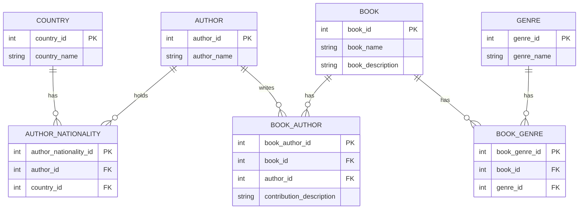
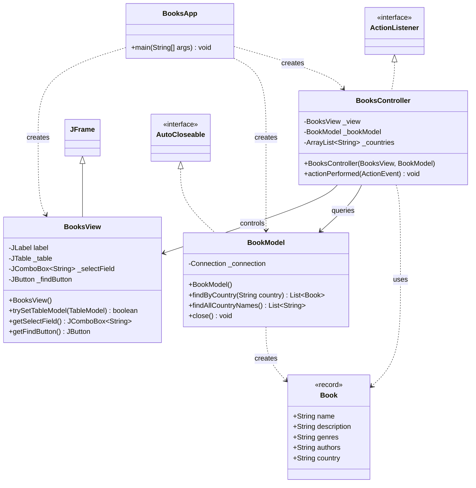

# BooksMvcSwing

A Java Swing desktop application that browses a SQLite book catalogue by author nationality.

## Why this exists

This is a practice project for implementing the Model-View-Controller pattern in Java Swing with a relational SQLite backend. 

Built alongside coursework in Advanced Java (INFO3136) as an exercise in MVC and database access.

## Status

Experimental and not actively maintained beyond this initial version.

## Requirements

- JDK 21 or later
- Maven 3.6 or later

Runs on any platform with a compatible JDK; verified on Linux.

## Run from source

The database at `data/books.db` ships committed in the repository, so no extra setup is needed before running the application.

```bash
git clone https://github.com/aaronpo97/BooksMvcSwing.git
cd BooksMvcSwing
mvn compile exec:java
```

This opens a window titled "Find" with a country dropdown and a Find button.

## Usage

### Find books by author nationality

1. Select a country from the **Country** dropdown.
2. Select **Find**.


## Database

The application reads from `data/books.db`, an existing SQLite database committed to the repository. 

[book_sqlite.sql](book_sqlite.sql) is the schema and seed script used to build it.



Rebuild the database from the script with any SQLite client:

```bash
sqlite3 data/books.db < book_sqlite.sql
```


## Architecture

The source under `src/main/java/booksapp` follows an MVC split:

- [BooksApp](src/main/java/booksapp/BooksApp.java) — entry point
- [mvc/BookModel](src/main/java/booksapp/mvc/BookModel.java) — data access layer. Runs the SQL queries against `data/books.db` and maps result sets to `Book` records.
- [mvc/BooksView](src/main/java/booksapp/mvc/BooksView.java) — the `JFrame` UI: a country dropdown, a Find button, and a results table, laid out with `GroupLayout`.
- [mvc/BooksController](src/main/java/booksapp/mvc/BooksController.java) — an `ActionListener` that loads the country list into the view on startup and, on Find, queries the model and pushes results into the table.
- [domain/Book](src/main/java/booksapp/domain/Book.java) — an immutable record (`name`, `description`, `genres`, `authors`, `country`) representing one query result row.



## License

MIT — see [LICENSE](LICENSE).
